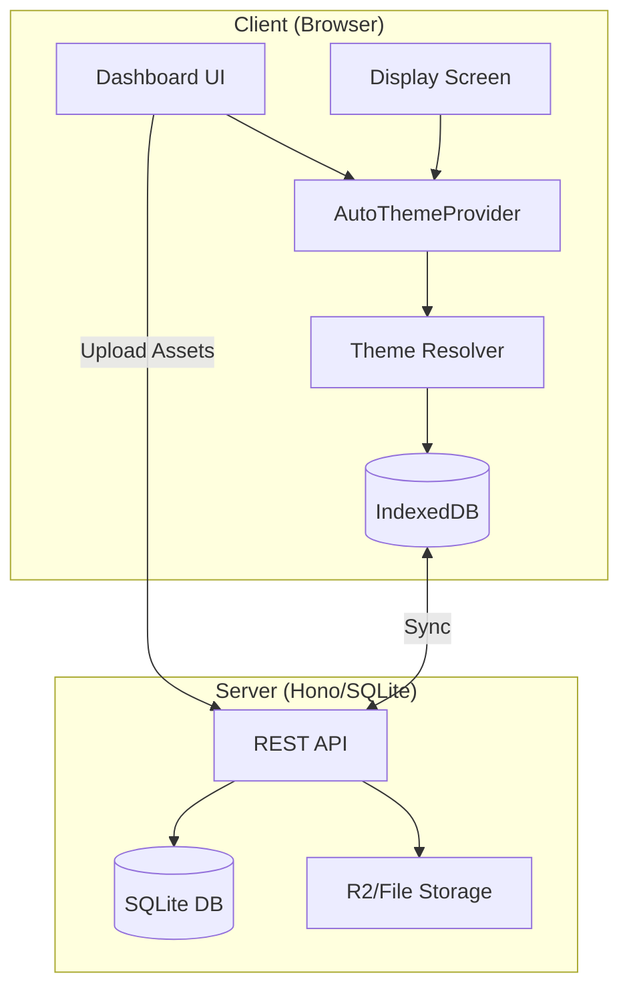

# 🎨 Theme System Documentation

Dokumentasi lengkap untuk sistem tema pada aplikasi Mosque Display.

---

## 📋 Daftar Isi

1. [Arsitektur](#arsitektur)
2. [Komponen Utama](#komponen-utama)
3. [Built-in Themes](#built-in-themes)
4. [Theme Resolver](#theme-resolver)
5. [Integrasi Storage](#integrasi-storage)
6. [Penggunaan](#penggunaan)
7. [API Reference](#api-reference)

---

## Arsitektur



### Komponen Utama

| File                         | Deskripsi                                      |
| ---------------------------- | ---------------------------------------------- |
| `themes/types.ts`            | Type definitions untuk theme config            |
| `themes/presets.ts`          | 5 built-in themes                              |
| `themes/resolver.ts`         | Logic untuk auto-switch berdasarkan jadwal     |
| `themes/ThemeContext.tsx`    | Global provider dengan auto-resolution         |
| `themes/useThemeHooks.ts`    | React hooks (`useAutoTheme`, `useThemeStyles`) |
| `themes/ThemeDebugPanel.tsx` | Debug panel untuk monitoring                   |
| `themes/layouts/`            | Layout components (Classic, Modern, Minimal)   |
| `themes/components/`         | Reusable theme-aware components                |

---

## Built-in Themes

### 1. Emerald Classic

- **ID**: `emerald`
- **Layout**: Classic
- **Warna**: Hijau zamrud dengan aksen emas
- **Cocok untuk**: Penggunaan sehari-hari

### 2. Night Sky

- **ID**: `night_sky`
- **Layout**: Modern
- **Warna**: Biru gelap dengan aksen cyan
- **Cocok untuk**: Malam hari

### 3. Sunset Warm

- **ID**: `sunset_warm`
- **Layout**: Classic
- **Warna**: Orange hangat dengan aksen kuning
- **Cocok untuk**: Waktu Maghrib

### 4. Royal Purple

- **ID**: `royal_purple`
- **Layout**: Modern
- **Warna**: Ungu royal dengan aksen pink
- **Cocok untuk**: Acara khusus

### 5. Ramadan Kareem

- **ID**: `ramadan_kareem`
- **Layout**: Classic
- **Warna**: Emas dengan aksen hijau
- **Cocok untuk**: Bulan Ramadan

---

## Theme Resolver

### Tipe Schedule

#### 1. Time-based

Aktif berdasarkan jam.

```typescript
{
  id: "night-theme",
  themeId: "night_sky",
  scheduleType: "time",
  startTime: "22:00",
  endTime: "05:00",
  priority: 1,
}
```

#### 2. Date Range

Aktif dalam rentang tanggal tertentu.

```typescript
{
  id: "ramadan-theme",
  themeId: "ramadan_kareem",
  scheduleType: "date_range",
  startDate: "2026-02-28",
  endDate: "2026-03-29",
  priority: 10,
}
```

#### 3. Prayer-based

Aktif berdasarkan waktu sholat.

```typescript
{
  id: "maghrib-theme",
  themeId: "sunset_warm",
  scheduleType: "prayer",
  prayerTrigger: "maghrib",
  offsetMinutes: -15, // 15 menit sebelum
  durationMinutes: 45,
  priority: 5,
}
```

### Prioritas

Semakin tinggi nilai `priority`, semakin diutamakan jika ada jadwal yang tumpang tindih.

---

## Integrasi Storage

### IndexedDB (Offline-First)

```typescript
import { themeAssetsLocal, themesLocal } from "./lib/localDatabase";

// Simpan tema kustom
await themesLocal.save({ name: "Custom", ... });

// Ambil semua aset tema
const assets = await themeAssetsLocal.getByTheme(themeLocalId);

// Cache gambar untuk offline
await themeAssetsLocal.cacheBlob(localId, blob);
```

### Sync Service

```typescript
import { syncService } from "./lib/syncService";

// Manual sync
await syncService.syncNow();

// Auto-sync setiap 60 detik
syncService.startAutoSync(60000);

// Cek status
const count = await syncService.getPendingCount();
```

### R2 Upload

```typescript
import { r2Upload } from "./lib/r2Upload";

// Upload dengan progress
const result = await r2Upload.uploadFile(file, {
  folder: "theme-assets",
  themeLocalId: "abc123",
  assetType: "background",
  onProgress: (pct) => console.log(`${pct}%`),
});
```

---

## Penggunaan

### 1. Wrap Aplikasi dengan Provider

```tsx
// main.tsx
import { AutoThemeProvider } from "./themes";

createRoot(document.getElementById("root")!).render(
  <AutoThemeProvider defaultThemeId="emerald">
    <App />
  </AutoThemeProvider>,
);
```

### 2. Gunakan Hook di Komponen

```tsx
import { useAutoTheme } from "./themes";

function MyComponent() {
  const { currentTheme, setTheme, isTransitioning } = useAutoTheme();

  return (
    <div style={{ backgroundColor: currentTheme.colors.bg }}>
      <button onClick={() => setTheme("night_sky")}>Ganti ke Night Sky</button>
    </div>
  );
}
```

### 3. Tampilkan Display dengan Tema

```tsx
import { ThemedDisplay } from "./themes";

// Di route #/display
<ThemedDisplay />;
```

### 4. Debug Panel

```tsx
import { ThemeDebugPanel } from "./themes";

// Tampilkan panel debug
<ThemeDebugPanel show={true} />;
```

---

## API Reference

### ThemeConfig

```typescript
interface ThemeConfig {
  id: string;
  name: string;
  description: string;

  colors: {
    bg: string;
    card: string;
    text: string;
    textMuted: string;
    primary: string;
    accent: string;
    border: string;
  };

  layout: {
    type: "classic" | "modern" | "minimal";
    clockPosition: "left" | "center" | "right";
    prayerGridColumns: 2 | 3 | 4;
    showOrnaments: boolean;
  };

  typography: {
    fontFamily: string;
    clockSize: string;
    headingSize: string;
    bodySize: string;
  };

  ornaments: {
    pattern: string;
    patternOpacity: number;
    headerDecoration: boolean;
    footerDecoration: boolean;
    cornerOrnaments: boolean;
  };

  animation: {
    transitionDuration: number;
    transitionType: "fade" | "slide" | "zoom";
    enableParticles: boolean;
    enableGlow: boolean;
  };
}
```

### ThemeScheduleConfig

```typescript
interface ThemeScheduleConfig {
  id: string;
  themeId: string;
  name?: string;
  scheduleType: "time" | "date_range" | "prayer" | "day_of_week";

  // Time-based
  startTime?: string;
  endTime?: string;

  // Date range
  startDate?: string;
  endDate?: string;

  // Prayer-based
  prayerTrigger?:
    | "imsak"
    | "subuh"
    | "terbit"
    | "dhuha"
    | "dzuhur"
    | "ashar"
    | "maghrib"
    | "isya";
  offsetMinutes?: number;
  durationMinutes?: number;

  // Day of week
  daysOfWeek?: number[];

  priority: number;
  isActive?: boolean;
}
```

### useAutoTheme()

```typescript
const {
  currentTheme, // ThemeConfig saat ini
  previousTheme, // Tema sebelumnya (saat transisi)
  isTransitioning, // Boolean status transisi
  availableThemes, // Array semua tema
  setTheme, // (id: string) => void
  setDefaultTheme, // (id: string) => void
  schedules, // Array jadwal aktif
  addSchedule, // (schedule) => void
  removeSchedule, // (id) => void
  updateSchedule, // (id, updates) => void
  enableAutoResolve, // Boolean
  setEnableAutoResolve, // (bool) => void
  resolveNow, // () => void - trigger manual
  nextChange, // Info perubahan tema berikutnya
  scheduleEvaluations, // Debug: evaluasi semua jadwal
  prayerTimes, // Waktu sholat saat ini
  setPrayerTimes, // Update waktu sholat
} = useAutoTheme();
```

---

## Server Endpoints

| Method | Endpoint               | Deskripsi      |
| ------ | ---------------------- | -------------- |
| GET    | `/api/themes`          | Semua tema     |
| POST   | `/api/themes`          | Buat tema baru |
| PUT    | `/api/themes/:id`      | Update tema    |
| DELETE | `/api/themes/:id`      | Hapus tema     |
| GET    | `/api/theme-assets`    | Semua aset     |
| POST   | `/api/upload`          | Upload file    |
| DELETE | `/api/upload/:key`     | Hapus file     |
| GET    | `/api/theme-schedules` | Semua jadwal   |
| POST   | `/api/theme-schedules` | Buat jadwal    |

---

## Struktur Folder

```
client/src/themes/
├── index.ts              # Main exports
├── types.ts              # Type definitions
├── presets.ts            # Built-in themes
├── resolver.ts           # Schedule resolution logic
├── ThemeContext.tsx      # Global provider
├── themeContextDef.ts    # Context definition
├── useThemeHooks.ts      # Custom hooks
├── ThemeDebugPanel.tsx   # Debug UI
├── ThemedDisplay.tsx     # Main display component
├── ThemeProvider.tsx     # Legacy provider
├── components/           # Reusable components
│   ├── index.ts
│   ├── ThemeTransition.tsx
│   ├── PrayerTimeCard.tsx
│   ├── ClockDisplay.tsx
│   ├── DateDisplay.tsx
│   ├── RunningText.tsx
│   └── MosqueHeader.tsx
└── layouts/              # Layout templates
    ├── index.ts
    ├── ClassicLayout.tsx
    ├── ModernLayout.tsx
    └── MinimalLayout.tsx
```

---

## Tips & Best Practices

1. **Selalu gunakan `useAutoTheme`** untuk akses tema, jangan akses context langsung.
2. **Cache aset** untuk offline dengan `themeAssetsLocal.preloadThemeAssets()`.
3. **Gunakan priority** yang berbeda untuk menghindari konflik jadwal.
4. **Test dengan Debug Panel** sebelum deploy ke production.
5. **Sync secara berkala** saat online untuk backup data.

---

_Dokumentasi ini dibuat untuk aplikasi Mosque Display v2.0_
